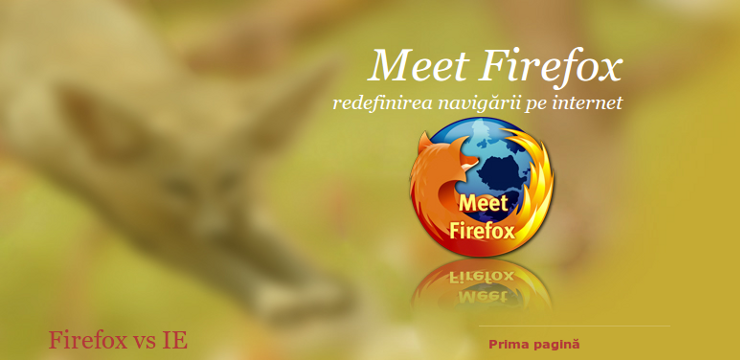

# This repository has been moved to [gitlab.com/paul-nechifor/meet-firefox](http://gitlab.com/paul-nechifor/meet-firefox).

Old readme:

# Meet Firefox

A silly project I did in my first semester of college (2008) with two other guys
for my [E-Communication][1] course with the purpose of promoting Firefox.
Firefox was the best browser back then.

Also see [my individual homework][2] for the first part of the course.

[1]: http://profs.info.uaic.ro/~mihaela/teach/com/index.html
[2]: https://github.com/paul-nechifor/college-website
